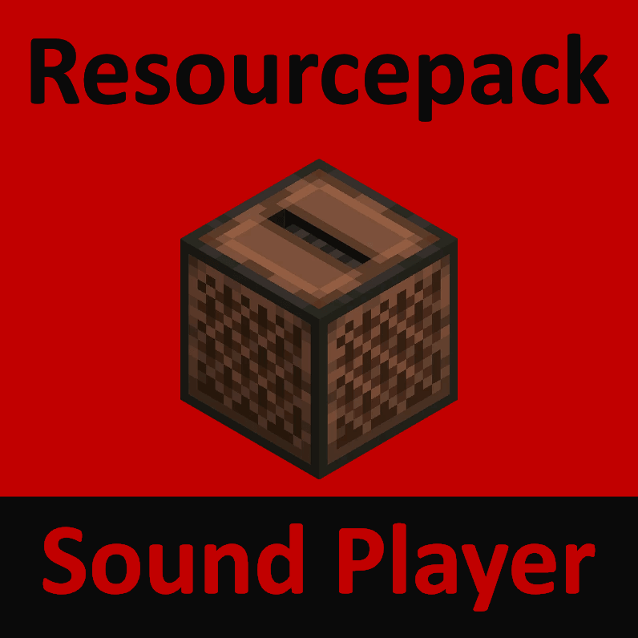
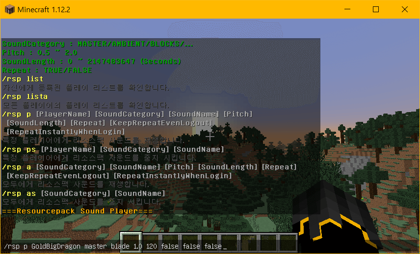

<a href="../README.md">📕 English</a> <a href="README_KO.md">📕 한국어</a> <a href="README_JP.md">📕 日本</a> <a href="README_CN.md">📕 中文</a> <a href="README_RU.md">📕 Pусский</a>  
# 마인크래프트 리소스팩 사운드 플레이어

<p align="center"></p>

<a href="https://www.minecraft.net/">마인크래프트</a> 리소스팩 속 음원 파일을 재생시켜 주는 플러그인입니다.

  

---
## 명령어
| 플레이스홀더 | 의미 | 예시값 |
|:---:|:---:|:---|
| SoundCategory | 리소스팩 디렉터리 혹은 마인크래프트 자체 sounds.json에 정의된 category명 | blocks  |
| SoundName | 리소스팩 디렉터리 혹은 마인크래프트 자체 sounds.json에 정의된 key값 | block.anvil.fall |
| Pitch | 재생 속도 | 1.2 |
| SoundLength | 반복재생 주기(초) | 120 |
| Repeat | 반복재생 여부 | true |
| KeepRepeatEvenLogout | 로그아웃 이후에도 반복재생 여부 | false |
| RepeatInstantlyWhenLogin | 재접속 시 즉각 사운드 재생 여부 | false |  

* /rsp list
	```
	자신에게 등록된 플레이 리스트를 확인합니다.
	```
* /rsp lista
	```
	모든 플레이어의 플레이 리스트를 확인합니다.
	```
* /rsp p [PlayerName] [SoundCategory] [SoundName] [Pitch] [SoundLength] [Repeat] [KeepRepeatEvenLogout] [RepeatInstantlyWhenLogin]
	```
	특정 플레이어에게 리소스팩 사운드를 재생합니다.
	```
* /rsp ps [PlayerName] [SoundCategory] [SoundName]
	```
	특정 플레이어에게 재생되고 있는 사운드를 중지 시킵니다.
	```
* /rsp a [SoundCategory] [SoundName] [Pitch] [SoundLength] [Repeat] [KeepRepeatEvenLogout] [RepeatInstantlyWhenLogin]
	```
	모두에게 리소스팩 사운드를 재생합니다.
	```
* /rsp as [SoundCategory] [SoundName]
	```
	모두에게 특정 사운드를 중지 시킵니다.
	```

### 플러그인 테스트 및 사용 방법:
1. 사운드 리소스팩이 없을 경우, <a href="../bin/(Resourcepack) TestSoundResourcePack.zip">테스트용 리소스팩</a>을 다운로드하여 ```C:/Users/[사용자 명]/AppData/Roaming/.minecraft/resourcepacks``` 디렉터리로 이동 시킵니다.  
<p align="center"></p>  
  
2. <a href="../bin/(Plugin) ResourcepackSoundPlayer.jar">플러그인</a>을 다운로드하여 ```C:/[본인의 마인크래프트 서버 디렉터리]/plugins``` 디렉터리로 이동 시킵니다.  
<p align="center"></p>  
  
3. 서버를 실행시킵니다.  
<p align="center"></p>  
  
4. 서버에 접속합니다.  
<p align="center"></p>  
  
5. 환경설정 메뉴에서 리소스팩을 적용시킵니다.  
<p align="center"></p>  
  
6. 명령어를 입력하여 리소스팩 사운드를 재생시켜봅니다.

| SoundCategory | SoundName | 출처 |
|:---:|:---:|:---|
| master | choir1 | http://peritune.com/j_choir_chant1-3/ |
| master | choir2 | http://peritune.com/j_choir_chant1-3/ |
| master | choir3 | http://peritune.com/j_choir_chant1-3/ |
| master | win | http://peritune.com/j_choir_chant1-3/ |
| master | blade | http://www.hmix.net/music_gallery/feeling/hard.htm |  

[](./06 plugin test.mp4)

---

## 업데이트
| 날짜 | 내용 | 업데이트 내용 |
|:---:|:---:|:---|
| 2019. 10. 15. | 기능 추가 | 플러그인이 개발됨. |
| 2021. 08. 05. | 기능 추가 | 모든 플레이어를 대상으로 재생하는 기능이 추가됨. |
| 2021. 08. 05. | 기능 추가 | 재접속 시에도 반복 재생을 유지 On/Off 옵션이 추가됨. |
| 2021. 08. 05. | 기능 추가 | 재접속 시 즉시 반복 재생 기능이 추가됨. |
| 2023. 01. 27. | 버그 수정 | 명령어 입력 시 발생하는 ArrayIndexOutOfBoundsException을 해결함. |  
| 2023. 01. 27. | 기능 추가 | 모든 플레이어의 플레이 리스트를 확인하는 기능이 추가됨. |  
---

## 기타
이 플러그인은 스크립팅 플러그인 사용자가 리소스팩 사운드를 멀리 까지 재생 시키는 방법이 난해하다는 글을 읽고 GoldBigDragon이 제작하였습니다.