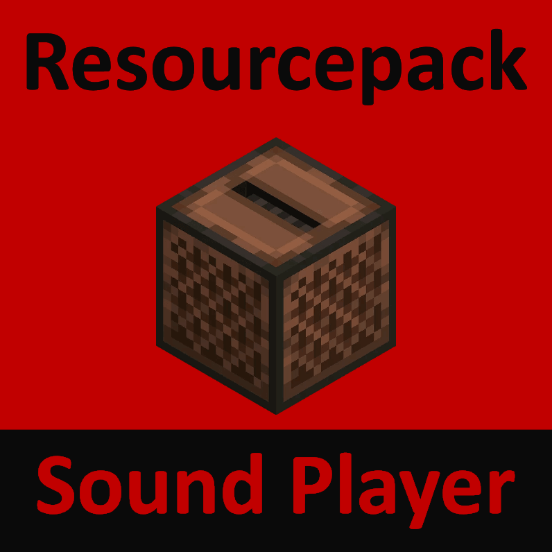

<a href="README.md">📕 English</a> <a href="GLOBAL_README/README_KO.md">📕 한국어</a> <a href="GLOBAL_README/README_JP.md">📕 日本</a> <a href="GLOBAL_README/README_CN.md">📕 中文</a> <a href="GLOBAL_README/README_RU.md">📕 Pусский</a>   
# Minecraft Resourcepack Sound Player

<p align="center"></p>

This plugin is plays sound files in <a href="https://www.minecraft.net/">Minecraft</a> resource packs.

  

---
## Commands
| Placeholder | Mean | Example |
|:---:|:---:|:---|
| SoundCategory | The category name defined in the resource pack directory or minecraft itself 'sounds.json' | blocks  |
| SoundName | Key value defined in resource pack directory or minecraft itself 'sounds.json' | block.anvil.fall |
| Pitch | Play speed | 1.2 |
| SoundLength | Repeat playback period (seconds) | 120 |
| Repeat | Whether or not to repeat | true |
| KeepRepeatEvenLogout | Whether or not to repeat after logout | false |
| RepeatInstantlyWhenLogin | Play sound immediately upon login | false |  

* /rsp list
	```
	Check the playlists registered to talker.
	```
* /rsp lista
	```
	Check all players' playlists.
	```
* /rsp p [PlayerName] [SoundCategory] [SoundName] [Pitch] [SoundLength] [Repeat] [KeepRepeatEvenLogout] [RepeatInstantlyWhenLogin]
	```
	Play resource pack sounds for a specific player.
	```
* /rsp ps [PlayerName] [SoundCategory] [SoundName]
	```
	Stops the sound playing for a specific player.
	```
* /rsp a [SoundCategory] [SoundName] [Pitch] [SoundLength] [Repeat] [KeepRepeatEvenLogout] [RepeatInstantlyWhenLogin]
	```
	Play resource pack sounds for all players.
	```
* /rsp as [SoundCategory] [SoundName]
	```
	Stops the sound playing for all players.
	```

### How to test and use this plugin:
1. If there is no sound resource pack, download <a href="./bin/(Resourcepack) TestSoundResourcePack.zip">Test resource pack</a> to ```C:/Users/[user name]/AppData Move it to /Roaming/.minecraft/resourcepacks``` directory.  
<p align="center"></p>  
  
2. Download the <a href="./bin/(Plugin) ResourcepackSoundPlayer.jar">plugin</a> and move it to ```C:/[Your Minecraft server directory]/plugins``` directory.  
<p align="center"></p>  
  
3. Run your Minecraft server.  
<p align="center"></p>  
  
4. Log in to the server.  
<p align="center"></p>  
  
5. Apply the resource pack in the configuration menu.  
<p align="center"></p>  
  
6. Execute the command to play the resource pack sound.

| SoundCategory | SoundName | Authorship |
|:---:|:---:|:---|
| master | choir1 | http://peritune.com/j_choir_chant1-3/ |
| master | choir2 | http://peritune.com/j_choir_chant1-3/ |
| master | choir3 | http://peritune.com/j_choir_chant1-3/ |
| master | win | http://peritune.com/j_choir_chant1-3/ |
| master | blade | http://www.hmix.net/music_gallery/feeling/hard.htm |  

[](./GLOBAL_README/06 plugin test.mp4)

---

## Update
| Date | Work | Description |
|:---:|:---:|:---|
| 2019. 10. 15. | ADD | This plugin was created. |
| 2021. 08. 05. | ADD | Play sound to all players function. |
| 2021. 08. 05. | ADD | On/Off option to keep repeat playback even when after logout. |
| 2021. 08. 05. | ADD | Instant replay function when login. |
| 2023. 01. 27. | BUG FIXED | ArrayIndexOutOfBoundsException that occurred when execute a command. |  
| 2023. 01. 27. | ADD | Check all player's playlists function. |  

---
## More details
This plugin was created by GoldBigDragon after reading that scripting plugin users had a hard time getting resource pack sounds to play far.